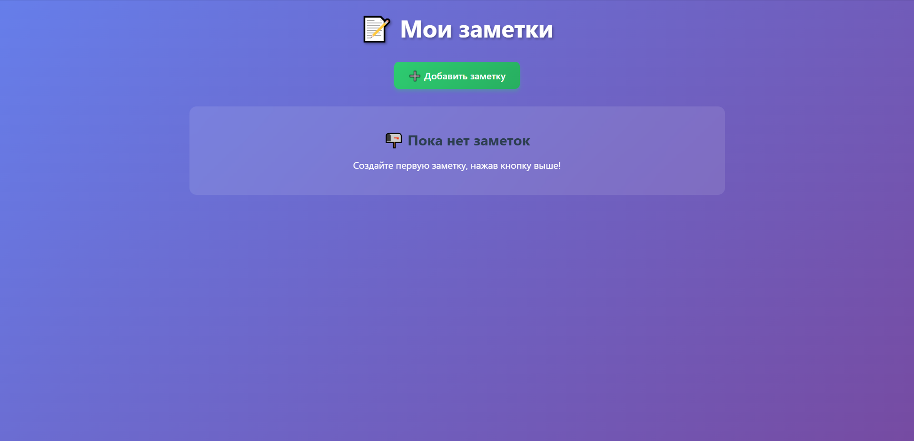

# Самостоятельная работа, Тема 9 "Заметки с тегами", Мингазов Альмир, группа ИС-201кН

Веб-приложение для создания текстовых заметок с возможностью добавления тегов и удобной фильтрации.

Зажмите Ctrl (Control), наведите курсор на docs/screenshot-main.png и кликните:


## Инструкция по запуску
1. Установить зависимости: `pip install flask`
2. Запустить файл `app.py`: `python app.py`
3. Открыть в браузере адрес `http://127.0.0.1:5000`

## Запуск тестов

Для проверки работы приложения запустите тесты:
```bash
pytest tests/test_app.py -v